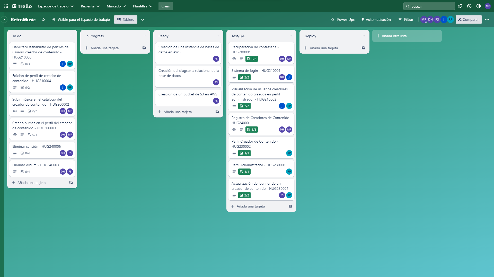
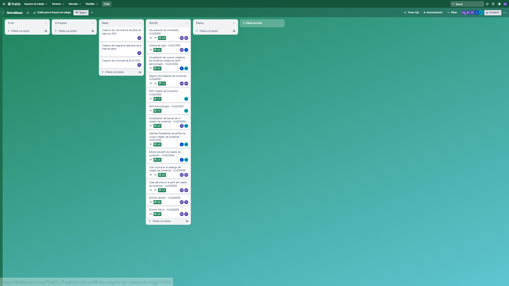

## Reporte Sprint 2 | Fase 1 

### _Grabación de Scrum Planning_
Esta reunión marcó el inicio del segundo sprint de la primera fase del proyecto, donde se discutieron y repartieron las tareas que conlleva dicha propuesta realizada en el primer sprint, continuando con los roles tomados para cada integrante. Esta realizada el día 13 de Agosto, donde a continuación se muestra su respectiva grabación:

        https://drive.google.com/file/d/14JwDnznITSZ3w43VPimLZpRSgJ_K6fUq/view?usp=drive_link

### _Grabaciones de Daily Scrum_
Se realizaron reuniones diarias donde se discutían los avances de la fase 1 del proyecto proporcionado, donde se respondían las preguntas: ¿Qué hice hoy?, ¿Que haré mañana?, y se discutieron dificultades para posibles soluciones dentro de las mismas. Las grabaciones inician desde el día 14 hasta el 18 de Agosto en días hábiles, omitiendo el 15 de Agosto al ser asueto, las cuales se presentan a continuación:

- 14 de Agosto

        https://drive.google.com/file/d/1Tqxz-mRx9rfjWTCilNDRwZ5N8y2tWdZF/view?usp=drive_link

- 16 de Agosto

        https://drive.google.com/file/d/1uxg_f5nNkIo5nveZPrn8Bwtco8JqX_1S/view?usp=drive_link

- 17 de Agosto

        https://drive.google.com/file/d/1tHthatpd0sSSEeNfxV6Bmukez40CbouK/view?usp=drive_link

- 18 de Agosto

        https://drive.google.com/file/d/18qaqePVqw16ESkgNGMhFLHfN3G4uL6Cq/view?usp=drive_link

### _Grabación de Scrum Retrospective_
Esta reunión marcó el fin del segundo y último sprint de la primera fase del proyecto proporcionado, donde se respondían las preguntas: ¿Qué se hizo bien durante el Sprint?, ¿Qué se hizo mal durante el Sprint? y ¿Qué mejoras se deben implementar para el próximo sprint?, esto realizado por cada integrante del grupo.

        https://drive.google.com/file/d/1jUKTc7Yg79Co4qqKaBt_-W-nxEEGICGO/view?usp=drive_link

### _Elementos del Sprint Backlog_

| Nombre | Encargado/s  | Terminado |
| ------ | ------------ | --------- | 
| Subir música a la plataforma | David Maldonado y Marvin Estrada | Si |
| Deshabilitar usuario creador de contenido | Rodrigo Porón y Javier Alfaro | Si | 
| Creación de albumes | Rodrigo Porón y Marvin Estrada | Si |
| Editar perfil creador de contenido | Rodrigo Porón y Javier Alfaro | Si |
| Eliminar album | David Maldonado y Fernando Gómez | Si |
| Eliminar canción | David Maldonado y Fernando Gómez | Si |

### _Tablero previo al inicio del Sprint_

### _Tablero al finalizar el Sprint_

###### _2023 - Laboratorio de Análisis y Diseño de Sistemas 2_
---
