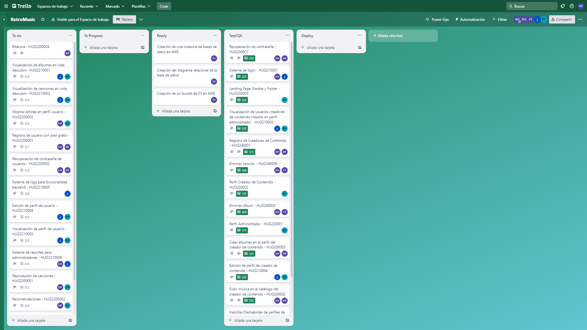

## Reporte Sprint 1 | Fase 2 

### _Grabación de Scrum Planning_
Esta reunión marcó el inicio del primer sprint de la segunda fase del proyecto, donde se discutieron y repartieron las tareas que conlleva dicha propuesta realizada en el primer sprint de la primera fase del mismo, continuando con los roles tomados para cada integrante. Esta realizada el día 28 de Agosto, donde a continuación se muestra su respectiva grabación:

### _Grabaciones de Daily Scrum_
Se realizaron reuniones diarias donde se discutían los avances de la fase 2 del proyecto proporcionado, donde se respondían las preguntas: ¿Qué hice hoy?, ¿Que haré mañana?, y se discutieron dificultades para posibles soluciones dentro de las mismas. Las grabaciones inician desde el día 29 de Agosto hasta el 08 de Septiembre en días hábiles, las cuales se presentan a continuación:

- 29 de Agosto

- 30 de Agosto

- 31 de Agosto

- 01 de Septiembre

- 04 de Septiembre

- 05 de Septiembre

- 06 de Septiembre

- 07 de Septiembre

- 08 de Septiembre

### _Grabación de Scrum Retrospective_
Esta reunión marcó el fin del primer sprint de la segunda fase del proyecto proporcionado, donde se respondían las preguntas: ¿Qué se hizo bien durante el Sprint?, ¿Qué se hizo mal durante el Sprint? y ¿Qué mejoras se deben implementar para el próximo sprint?, esto realizado por cada integrante del grupo, esta realizada el 10 de Septiembre.

### _Elementos del Sprint Backlog_

| Nombre | Encargado/s  | Terminado |
| ----- | ----- | ----- | 
| Registro usuario plan gratuito | David Maldonado y Marvin Estrada | Si |
| Recuperación de contraseña de usuario | David Maldonado y Marvin Estrada | Si |
| Perfil usuario plan gratuito | Rodrigo Porón | Si |
| Perfil creador de contenido | Rodrigo Porón | Si |
| Deshabilitar usuario creador de contenido | Rodrigo Porón y Javier Alfaro | Si | 
| Subir banner de creador de contenido | Rodrigo Porón y Fernando Gómez | Si |
| Subir música a la plataforma | David Maldonado y Marvin Estrada | Si |
| Creación de albumes | Rodrigo Porón y Marvin Estrada | Si |
| Editar perfil creador de contenido | Rodrigo Porón y Javier Alfaro | Si |
| Eliminar album | David Maldonado y Fernando Gómez | Si |
| Eliminar canción | David Maldonado y Fernando Gómez | Si |
| Mostrar albumes en vista usuario | Rodrigo Porón y Javier Alfaro | Si | 
| Mostrar canciones en vista usuario | Rodrigo Porón y Javier Alfaro | Si | 
| Mostrar artistas en vista usuario | Rodrigo Porón y Marvin Estrada | Si | 
| Ver datos del usuario | Rodrigo Porón y Javier Alfaro | Si | 
| Editar datos del usuario | Rodrigo Porón y Javier Alfaro | Si | 
| Implementación de logs para el backend para este sprint | Javier Alfaro | Si |
| Pruebas para funcionalidades | Fernando Gómez | Si |
| Implementación de bitácora | Fernando Gómez | Si |
| Diseño nuevo de base de datos para este sprint | Fernando Gómez | Si |
| Despliegue para el backend para este sprint | Marvin Estrada | Si |
| Despliegue para el frontend para este sprint | Rodrigo Porón | Si |

### _Tablero previo al inicio del Sprint_

### _Tablero al finalizar el Sprint_

###### _2023 - Laboratorio de Análisis y Diseño de Sistemas 2_
---