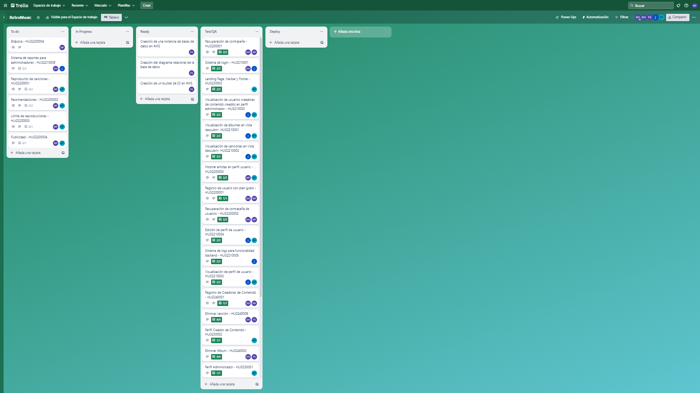

## Reporte Sprint 2 | Fase 2 

### _Grabación de Scrum Planning_
Esta reunión marcó el inicio del segundo sprint de la segunda fase del proyecto, donde se discutieron y repartieron las tareas que conlleva dicha propuesta realizada en la primera fase del proyecto, continuando con los roles tomados para cada integrante. Esta realizada el día 11 de Septiembre, donde a continuación se muestra su respectiva grabación:

### _Grabaciones de Daily Scrum_
Se realizaron reuniones diarias donde se discutían los avances de la fase 2 del proyecto proporcionado, donde se respondían las preguntas: ¿Qué hice hoy?, ¿Que haré mañana?, y se discutieron dificultades para posibles soluciones dentro de las mismas. Las grabaciones inician desde el día 12 hasta el 19 de Septiembre en días hábiles, omitiendo el 14 y 15 de Septiembre al ser asueto, las cuales se presentan a continuación:

- 12 de Septiembre

- 13 de Septiembre

- 18 de Septiembre

- 19 de Septiembre

### _Grabación de Scrum Retrospective_
Esta reunión marcó el fin del segundo y último sprint de la segunda fase del proyecto proporcionado, donde se respondían las preguntas: ¿Qué se hizo bien durante el Sprint?, ¿Qué se hizo mal durante el Sprint? y ¿Qué mejoras se deben implementar para el próximo sprint?, esto realizado por cada integrante del grupo, esta realizada el 20 de Septiembre.

### _Elementos del Sprint Backlog_

| Nombre | Encargado/s  | Terminado |
| ------ | ------------ | --------- | 
| Reporte de top 5 canciones más escuchadas | David Maldonado y Javier Alfaro | Si | 
| Reporte de top 5 artistas más escuchados | David Maldonado y Javier Alfaro | Si | 
| Reporte de top 5 albumes más escuchados | David Maldonado y Javier Alfaro | Si | 
| Reproductor de canciones en el perfil usuario Play/Pausa y Siguiente/Anterior  | David Maldonado y Marvin Estrada | Si |
| Recomendaciones en la vista descubrir | Rodrigo Porón y Marvin Estrada | Si | 
| Límite de reproducciones por día (15 reproducciones)  | Rodrigo Porón y Marvin Estrada | Si | 
| Publicidad | David Maldonado y Marvin Estrada | Si |
| Implementación de logs para el backend para este sprint | Javier Alfaro | Si |
| Pruebas para funcionalidades | Fernando Gómez | Si |
| Diseño nuevo de base de datos para este sprint | Fernando Gómez | Si |
| Despliegue para el backend para este sprint | Marvin Estrada | Si |
| Despliegue para el frontend para este sprint | Rodrigo Porón | Si |

### _Tablero previo al inicio del Sprint_

### _Tablero al finalizar el Sprint_

###### _2023 - Laboratorio de Análisis y Diseño de Sistemas 2_
---
