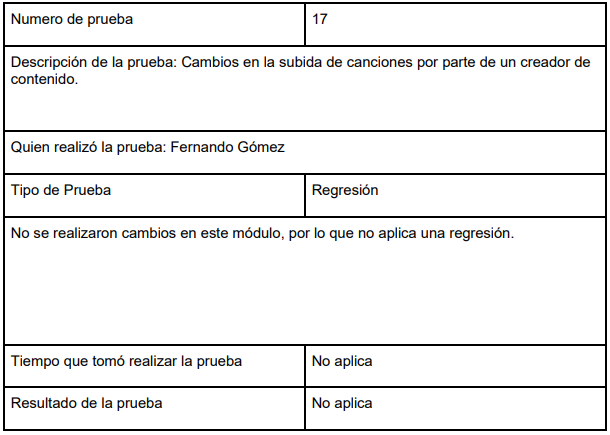

## Pruebas funcionales 

* ### Pruebas del registro de un cliente

* ### Sección de Descubrir artistas

* ### Visualización y deshabilitación de creadores de contenido

* ### Mostrar publicidad para un cliente gratuito

* ### Visualización de un álbum

* ### Subir una canción como creador de contenido

* ### Reproducir canciones como cliente

* ### Eliminación de canciones de un creador de contenido

* ### Eliminación de álbumes de un creador de contenido

* ### Recorrer álbum de canciones

## Bitacora

|Número prueba |Nombre prueba | Quien realizó la prueba |Tiempo | Resultado  | 
| ----- | ----- | ----- | ----- | ----- |
| 1 | Registro de un usuario en plan gratuito | Fernando Gómez | 2 minutos | Satisfactorio | 
| 2 | Registro de un nuevo cliente ingresando sus datos desde el frontend | Fernando Gómez | No aplica | No aplica | 
| 3 | Registro de un nuevo cliente ingresando sus datos desde el frontend y conexión a la base de datos. | Fernando Gómez | 3 minutos | Satisfactorio | 
| 4 | Sección para descubrir artistas | Fernando Gómez | 2 minutos | Satisfactorio | 
| 5 | Cambios en la sección para descubrir artistas | Fernando Gómez | 2 minutos | Satisfactorio | 
| 6 | Sección para descubrir artistas obteniendo la información de la base de datos | Fernando Gómez | 4 minutos | Satisfactorio | 
| 7 | Visualización de usuarios de creadores de contenido y su deshabilitación | Fernando Gómez | 5 minutos | Satisfactorio | 
| 8 | Visualización de usuarios de creadores de contenido y su deshabilitación | Fernando Gómez | No aplica | No aplica | 
| 9 | Comprobación de los usuarios deshabilitado | Fernando Gómez | 4 minutos | Satisfactorio | 
| 10 | Mostrar publicidad para el cliente de plan gratuito | Fernando Gómez | 3 minutos | Satisfactorio | 
| 11 | Mostrar publicidad para el cliente de plan gratuito | Fernando Gómez | No aplica | No aplica | 
| 12 | Mostrar publicidad exclusivamente para el cliente de plan gratuito | Fernando Gómez | 4 minutos | Satisfactorio | 
| 13 | Ver un álbum de un artista | Fernando Gómez | 4 minutos | Satisfactorio | 
| 14 | Cambios en la visualización de álbumes de artistas | Fernando Gómez | No aplica | No aplica | 
| 15 | Ver albumes de artistas obteniendo la información de la base de datos | Fernando Gómez | 1 minutos | Satisfactorio | 
| 16 |  Subir canción como creador de contenido | Fernando Gómez | 3 minutos | Satisfactorio | 
| 17 |  Cambios en la subida de canciones por parte de un creador de contenido | Fernando Gómez | No aplica | No aplica | 
| 18 | Reproducir canciones como cliente | Fernando Gómez | 2 minutos | Satisfactorio | 
| 19 | Cambios en la reproducción de canciones como cliente | Fernando Gómez | No aplica | No aplica | 
| 20 | Reproducir canciones como cliente desde un álbum | Fernando Gómez | 2 minutos | Satisfactorio | 
| 21 | Como creador de contenido, eliminar una canción de autoría propia | Fernando Gómez | 3 minutos | Satisfactorio | 
| 22 | Cambios en la eliminación de una canción | Fernando Gómez | No aplica | No aplica | 
| 23 | Como creador de contenido, eliminar una canción de autoría propia desde el frontend y comprobación en la base de datos | Fernando Gómez | 4 minutos | Satisfactorio | 
| 24 | Como creador de contenido, eliminar un álbum de autoría propia | Fernando Gómez | 3 minutos | Satisfactorio | 
| 25 | Cambios en la eliminación de un álbum de un creador de contenido | Fernando Gómez | 3 minutos | Satisfactorio | 
| 26 | Eliminación de relaciones entre álbumes y canciones | Fernando Gómez | 3 minutos | Satisfactorio | 
| 27 | Recorrer la lista de canciones de un álbum | Fernando Gómez | 3 minutos | Satisfactorio | 
| 28 | Cambios en el recorrido de la lista de canciones de un álbum | Fernando Gómez | No aplica | No aplica | 
| 29 | Recorrer la lista de canciones de un álbum | Fernando Gómez | 4 minutos | Satisfactorio | 