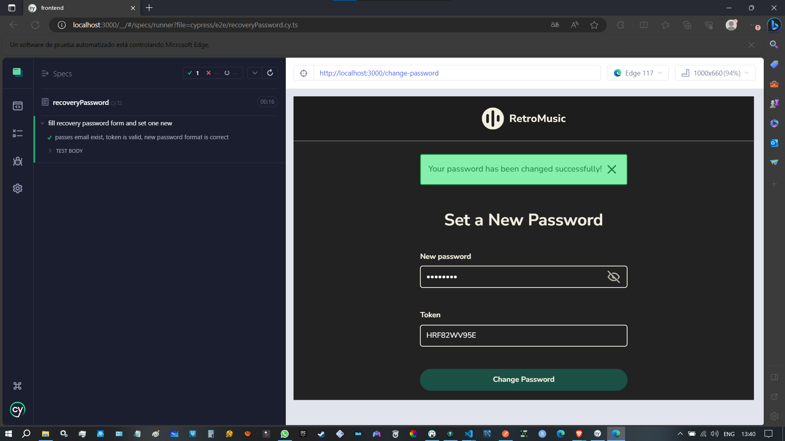
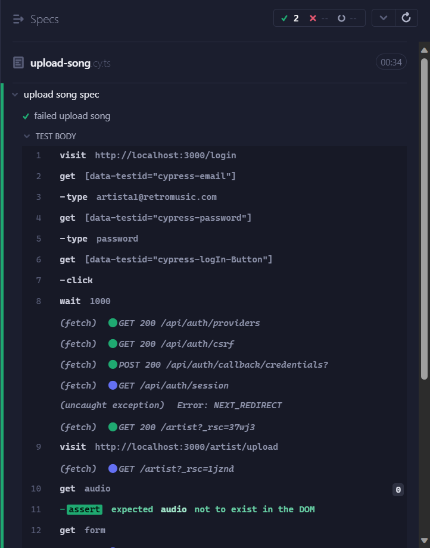

# Historias de usuario y pruebas asociadas | Fase 3 

---

## Registro de artistas/usuario - HUG2300002/HUG2300003 - versión móvil - Puntos de Historia=8 - Prioridad=Media

Como artista/usuario necesito un apartado para poder registrarme ingresando los datos respectivos para poder crear mi cuenta.

* El sistema debe permitir a los artistas llenar un formulario con sus datos para crear un perfil dentro de la plataforma.

**Prueba asociada E2E**
```


describe('fill register form', () => {
  it('user passes', () => {
    // User register view
    cy.visit('http://localhost:3000/register/user/')

    // data entry
    cy.get('[data-testid="cypress-email"]').type("cypress@retromusic.com")
    cy.get('[data-testid="cypress-password"]').type("password")
    cy.get('[data-testid="cypress-username"]').type("cypress")
    cy.get('[data-testid="cypress-day"]').type("01")
    cy.get('[data-testid="cypress-month"]').select("February")
    cy.get('[data-testid="cypress-year"]').type("1990")
    cy.get('[data-testid="cypress-Other"]').check()

    // data validations
    cy.get('[data-testid="cypress-email"]').should('have.value', "cypress@retromusic.com")
    cy.get('[data-testid="cypress-password"]').should('have.value', "password")
    cy.get('[data-testid="cypress-username"]').should('have.value', "cypress")
    cy.get('[data-testid="cypress-day"]').should('have.value', "01")
    cy.get('[data-testid="cypress-month"]').should('have.value', "February")
    cy.get('[data-testid="cypress-year"]').should('have.value', "1990")
    cy.get('[data-testid="cypress-Other"]').should('be.checked');

    // submit
    cy.get('[data-testid="cypress-signUp-Button"]').click();

    // submit response wait
    cy.wait(1000)
  })
```


```
  it('user not passes', () => {
    // User register view
    cy.visit('http://localhost:3000/register/user/')

    // data entry
    cy.get('[data-testid="cypress-email"]').type("cypress")
    cy.get('[data-testid="cypress-password"]').type("123")
    cy.get('[data-testid="cypress-username"]').type("c")
    cy.get('[data-testid="cypress-day"]').type("99")
    cy.get('[data-testid="cypress-month"]').select("February")
    cy.get('[data-testid="cypress-year"]').type("9999")
    
    // data validations
    cy.get('[data-testid="cypress-email"]').should('have.value', "cypress")
    cy.get('[data-testid="cypress-password"]').should('have.value', "123")
    cy.get('[data-testid="cypress-username"]').should('have.value', "c")
    cy.get('[data-testid="cypress-day"]').should('have.value', "99")
    cy.get('[data-testid="cypress-month"]').should('have.value', "February")
    cy.get('[data-testid="cypress-year"]').should('have.value', "9999")

    // submit
    cy.get('[data-testid="cypress-signUp-Button"]').click();

    // submit response wait
    cy.wait(1000)
  })
```


```
  it('artist not passes', () => {
    // Artist register view
    cy.visit('http://localhost:3000/register/')

    // data entry
    cy.get('[data-testid="cypress-email"]').type("cypressartist@retromusic.com")
    cy.get('[data-testid="cypress-password"]').type("password")
    cy.get('[data-testid="cypress-username"]').type("cypressartist")
    cy.get('[data-testid="cypress-day"]').type("01")
    cy.get('[data-testid="cypress-month"]').select("February")
    cy.get('[data-testid="cypress-year"]').type("1990")
    cy.get('[data-testid="cypress-Other"]').check()

    // data validations
    cy.get('[data-testid="cypress-email"]').should('have.value', "cypressartist@retromusic.com")
    cy.get('[data-testid="cypress-password"]').should('have.value', "password")
    cy.get('[data-testid="cypress-username"]').should('have.value', "cypressartist")
    cy.get('[data-testid="cypress-day"]').should('have.value', "01")
    cy.get('[data-testid="cypress-month"]').should('have.value', "February")
    cy.get('[data-testid="cypress-year"]').should('have.value', "1990")
    cy.get('[data-testid="cypress-Other"]').should('be.checked');

    // submit
    cy.get('[data-testid="cypress-signUp-Button"]').click();

    // submit response wait
    cy.wait(1000)
  })
```


```
  it('artist not passes', () => {
    // Artist register view
    cy.visit('http://localhost:3000/register/')

    // data entry
    cy.get('[data-testid="cypress-email"]').type("cypress")
    cy.get('[data-testid="cypress-password"]').type("123")
    cy.get('[data-testid="cypress-username"]').type("c")
    cy.get('[data-testid="cypress-day"]').type("99")
    cy.get('[data-testid="cypress-month"]').select("February")
    cy.get('[data-testid="cypress-year"]').type("9999")
    
    // data validations
    cy.get('[data-testid="cypress-email"]').should('have.value', "cypress")
    cy.get('[data-testid="cypress-password"]').should('have.value', "123")
    cy.get('[data-testid="cypress-username"]').should('have.value', "c")
    cy.get('[data-testid="cypress-day"]').should('have.value', "99")
    cy.get('[data-testid="cypress-month"]').should('have.value', "February")
    cy.get('[data-testid="cypress-year"]').should('have.value', "9999")

    // submit
    cy.get('[data-testid="cypress-signUp-Button"]').click();

    // submit response wait
    cy.wait(1000)
  })
})


```


---
## Recuperación de contraseña de usuarios - HUG2200002 - Puntos de Historia=5 - Prioridad=Baja

Como usuario cliente quiero tener la posibilidad de tener un apartado para poder recuperar mi contraseña en caso de olvidarla.

* Se debe tener un apartado para ingresar el correo electrónico del usuario para comprobar que existe.
* Se debe de poseer en el sistema una notificación por correo al usuario para indicarle el procedimiento para recuperar su contraseña y un formulario para llenar y cambiar la misma.


**Prueba asociada E2E**
```


describe('fill recovery password form and set one new', () => {

  

  //todo bien(correo existe en RetroMusic, token valido y password con el formato requerido correcto)
  it('passes, email exist, token is valid, new password format is correct', () => {
    // login view
    cy.visit('http://localhost:3000/login')

    //nos vamos a recuperacion de password desde el login
    cy.get('[data-testid="cypress-recoveryPassword-Button"]').click();

    // recovery password fill data ------------------------------

    //primero chequeamos que existe el input donde apelamos por nuestro cambio de password
    cy.get('[data-testid="cypress-email-recovery"]').should("exist")

    //agrego el correo que desea cambiar su password porq la olvido
    cy.get('[data-testid="cypress-email-recovery"]').type("javieralfarogt2@gmail.com")
    
    //una vez ingresado le damos al boton de send, para que nos envien un token y podamos cambiar el password
    cy.get('[data-testid="cypress-recoveryPassword-SendButton"]').click();

    // token response wait
    cy.wait(3000)

    // ahora seteamos la nueva password y agegamos el token que recibimos por correo
    cy.get('[data-testid="cypress-password"]').type("12345678")
    cy.get('[data-testid="cypress-token"]').type("HRF82WV95E")//esto cambia cada vez TuT

    cy.get('[data-testid="cypress-recoveryPassword-ChangeButton"]').click();

    // change password response wait
    cy.wait(3000)

  })
```




---

```
// error en la nueva password (correo existe en RetroMusic, token valido y password no cuenta con el formato requerido)
  it('not passes, password to short', () => {
    // login view
    cy.visit('http://localhost:3000/login')

    //nos vamos a recuperacion de password desde el login
    cy.get('[data-testid="cypress-recoveryPassword-Button"]').click();

    // recovery password fill data ------------------------------

    //primero chequeamos que existe el input donde apelamos por nuestro cambio de password
    cy.get('[data-testid="cypress-email-recovery"]').should("exist")

    //agrego el correo que desea cambiar su password porq la olvido
    cy.get('[data-testid="cypress-email-recovery"]').type("javieralfarogt2@gmail.com")
    
    //una vez ingresado le damos al boton de send, para que nos envien un token y podamos cambiar el password
    cy.get('[data-testid="cypress-recoveryPassword-SendButton"]').click();

    // token response wait
    cy.wait(3000)

    // ahora seteamos la nueva password y agegamos el token que recibimos por correo
    cy.get('[data-testid="cypress-password"]').type("123")
    cy.get('[data-testid="cypress-token"]').type("HRF82WV95E") //esto cambia cada vez TuT

    cy.get('[data-testid="cypress-recoveryPassword-ChangeButton"]').click();

    // change password response wait
    cy.wait(3000)

  })

```


---

```

  //error en el token(correo existe en RetroMusic, token invalido y password con el formato requerido correcto)
  it('not passes, token invalid', () => {
    // login view
    cy.visit('http://localhost:3000/login')

    //nos vamos a recuperacion de password desde el login
    cy.get('[data-testid="cypress-recoveryPassword-Button"]').click();

    // recovery password fill data ------------------------------

    //primero chequeamos que existe el input donde apelamos por nuestro cambio de password
    cy.get('[data-testid="cypress-email-recovery"]').should("exist")

    //agrego el correo que desea cambiar su password porq la olvido
    cy.get('[data-testid="cypress-email-recovery"]').type("javieralfarogt2@gmail.com")
    
    //una vez ingresado le damos al boton de send, para que nos envien un token y podamos cambiar el password
    cy.get('[data-testid="cypress-recoveryPassword-SendButton"]').click();

    // token response wait
    cy.wait(3000)

    // ahora seteamos la nueva password y agegamos el token que recibimos por correo
    cy.get('[data-testid="cypress-password"]').type("12345678")
    cy.get('[data-testid="cypress-token"]').type("FFFFFFFFFF")

    cy.get('[data-testid="cypress-recoveryPassword-ChangeButton"]').click();

    // change password response wait
    cy.wait(3000)

  })

```


---

```

  //error en el correo(correo no existe en RetroMusic y por ende no se puede cambiar el password, en el servicio)
  it('not passes, email invalid (dont exist in RetroMusic)', () => {
    // login view
    cy.visit('http://localhost:3000/login')

    //nos vamos a recuperacion de password desde el login
    cy.get('[data-testid="cypress-recoveryPassword-Button"]').click();

    // recovery password fill data ------------------------------

    //primero chequeamos que existe el input donde apelamos por nuestro cambio de password
    cy.get('[data-testid="cypress-email-recovery"]').should("exist")

    //agrego el correo que desea cambiar su password porq la olvido
    cy.get('[data-testid="cypress-email-recovery"]').type("javierAlfarogt777@gmail.com")
    cy.wait(5000)
    
    //una vez ingresado le damos al boton de send, para que nos envien un token y podamos cambiar el password
    cy.get('[data-testid="cypress-recoveryPassword-SendButton"]').click();

  })


})
```


---

## Sistema de login - HUG210001 - Puntos de Historia=8 - Prioridad=Alta

Como usuario, deseo poder iniciar sesión en mi cuenta personal para así acceder a mi contenido personal y servicios dentro del sistema.


* Se debe de tener un apartado para ingresar mi nombre de usuario y contraseña de manera segura. 
* Se debe de poseer un sistema el cual permita el poder recibir un mensaje de confirmación o de error si el nombre de usuario o la contraseña son incorrectos.


**Prueba asociada E2E**
```


describe('Login', () => {
  it('should log in with admin valid credentials', () => {
    cy.visit('http://localhost:3000/login')

    cy.get('[data-testid="cypress-email"]').type("admin@retromusic.com")
    cy.get('[data-testid="cypress-password"]').type("password")
    cy.get('[data-testid="cypress-logIn-Button"]').click();
    
    cy.wait(1000)

    cy.visit('http://localhost:3000/admin')

    cy.wait(1000)
    cy.get('[data-testid="cypress-artists"]').should('exist')
    .should('have.text', 'Artistas')
  })

  it('should log in with artist valid credentials', () => {
    cy.visit('http://localhost:3000/login')

    cy.get('[data-testid="cypress-email"]').type("artista1@retromusic.com")
    cy.get('[data-testid="cypress-password"]').type("password")
    cy.get('[data-testid="cypress-logIn-Button"]').click();

    cy.wait(1000)

    cy.visit('http://localhost:3000/artist')

    cy.wait(1000)

    cy.get('[data-testid="cypress-header"]').should('exist')
  })

  it('should log in with user valid credentials', () => {
    cy.visit('http://localhost:3000/login')

    cy.get('[data-testid="cypress-email"]').type("usuario@retromusic.com")
    cy.get('[data-testid="cypress-password"]').type("password")
    cy.get('[data-testid="cypress-logIn-Button"]').click();

    cy.wait(1000)

    cy.visit('http://localhost:3000/user')

    cy.wait(1000)

    cy.get('[data-testid="cypress-recommendations"]').should('exist')
    .should('have.text', 'Recommendations')
  })

})


```


---

## Actualización del banner de un creador de contenido-HUG230004 - Puntos de Historia=8 - Prioridad= Media

Como usuario creador de contenido de la plataforma deseo subir o actualizar la imagen del banner en mi perfil.


* El usuario creador de contenido debe ser capaz de ingresar a su perfil, seleccionar la opción para subir un banner y actualizarlo.

**Prueba asociada E2E**
```


import 'cypress-file-upload'

describe('fill banner form', () => {
    it('passes', () => {
      // login view
      cy.visit('http://localhost:3000/login')

      // login form fill data
      cy.get('[data-testid="cypress-email"]').type("artista1@retromusic.com")
      cy.get('[data-testid="cypress-password"]').type("password")
      cy.get('[data-testid="cypress-logIn-Button"]').click();
      
      // login response wait
      cy.wait(1000)
      
      // banner upload view
      cy.visit('http://localhost:3000/artist/profile/banner')
  
      // data entry
      const filePath = './resources/banner.jpg';
      cy.get('[data-testid="cypress-file"]').attachFile(filePath);

      // submit
      cy.get('[data-testid="cypress-upload-button"]').click();
      
      // Upload response wait
      cy.wait(1000)
    })

```


```
    it('not passes', () => {
        // login view
        cy.visit('http://localhost:3000/login')
  
        // login form fill data
        cy.get('[data-testid="cypress-email"]').type("artista1@retromusic.com")
        cy.get('[data-testid="cypress-password"]').type("password")
        cy.get('[data-testid="cypress-logIn-Button"]').click();
        
        // login response wait
        cy.wait(1000)
        
        // banner upload view
        cy.visit('http://localhost:3000/artist/profile/banner')
    
        // data entry
        const filePath = './resources/banner.txt';
        cy.get('[data-testid="cypress-file"]').attachFile(filePath);
  
        // submit
        cy.get('[data-testid="cypress-upload-button"]').click();

        // Upload response wait
        cy.wait(1000)
      })
  })


```


---
## Subir música en vista catálogo-HUG240004 - Puntos de Historia=20 Prioridad = Alta

Como artista necesito un apartado para poder registrarme ingresando los datos respectivos para poder crear mi cuenta.

* El sistema debe permitir a los artistas llenar un formulario con sus datos para crear un perfil dentro de la plataforma.

**Prueba asociada E2E**
```


describe('upload song spec', () => {
  it('failed upload song', () => {
    cy.visit('http://localhost:3000/login')

    cy.get('[data-testid="cypress-email"]').type("artista1@retromusic.com")
    cy.get('[data-testid="cypress-password"]').type("password")
    cy.get('[data-testid="cypress-logIn-Button"]').click();

    cy.wait(1000)
      
    cy.visit('http://localhost:3000/artist/upload')
    cy.get('audio').should('not.exist')

    cy.get('form').within(() => {
      cy.get('input[id="name"]').type('test song')
      cy.get('input[id="genre"]').type('test genre')
      cy.get('button').click()
      cy.wait(1000)
    })
  })
```




```
  it('upload song', () => {
    cy.visit('http://localhost:3000/login')

    cy.get('[data-testid="cypress-email"]').type("artista1@retromusic.com")
    cy.get('[data-testid="cypress-password"]').type("password")
    cy.get('[data-testid="cypress-logIn-Button"]').click();

    cy.wait(1000)
      
    cy.visit('http://localhost:3000/artist/upload')
    cy.get('audio').should('not.exist')

    const filePath = 'cypress/fixtures/resources/track.mp3';
    cy.get('form').within(() => {
      cy.get('input[type="file"]').selectFile(filePath, { force: true });
      cy.get('input[id="name"]').type('test song')
      cy.get('input[id="genre"]').type('test genre')
      cy.get('button').click()
      cy.wait(1000)
    })
  })
})
```


---
## Crear álbumes en el perfil del creador de contenido - HUG200003 - Puntos de Historia=20 - Prioridad=Alta

Como creador de contenido quiero tener la posibilidad de crear álbumes para agrupar mis canciones o serie de podcast.

* Se debe tener un apartado para crear un álbum, ingresando el nombre, fecha de lanzamiento, poder seleccionar una imagen de portada para el álbum y seleccionar las canciones o podcast que pertenecen al mismo.


**Prueba asociada E2E**
```


import { apiUrls, baseUrl } from '@/constants/urls'
import 'cypress-file-upload'

describe('create album spec', () => {
  it('create single', () => {
    cy.visit('http://localhost:3000/login')

    cy.get('[data-testid="cypress-email"]').type("artista1@retromusic.com")
    cy.get('[data-testid="cypress-password"]').type("password")
    cy.get('[data-testid="cypress-logIn-Button"]').click();

    cy.wait(1000)
      
    cy.visit('http://localhost:3000/artist/create-album')
    
    cy.get('[data-testid="cypress-album-name"]').type("Album de prueba")
    
    const filePath = './resources/banner.jpg';
    cy.get('[data-testid="cypress-file"]').attachFile(filePath);

    cy.get('[data-testid="cypress-album-cover"]').should('exist')
    
    cy.get('[data-testid="cypress-song-0"]').click()

    cy.intercept('POST', baseUrl + apiUrls.artist.createAlbum).as('createAlbum')

    cy.get('[data-testid="cypress-album-create"]').click()

    cy.wait('@createAlbum').its('response.statusCode').should('eq', 200)

  })

  it('create album', () => {
    cy.visit('http://localhost:3000/login')

    cy.get('[data-testid="cypress-email"]').type("artista1@retromusic.com")
    cy.get('[data-testid="cypress-password"]').type("password")
    cy.get('[data-testid="cypress-logIn-Button"]').click();

    cy.wait(1000)
      
    cy.visit('http://localhost:3000/artist/create-album')
    
    cy.get('[data-testid="cypress-album-name"]').type("Album de prueba")
    
    const filePath = './resources/banner.jpg';
    cy.get('[data-testid="cypress-file"]').attachFile(filePath);

    cy.get('[data-testid="cypress-album-cover"]').should('exist')
    
    cy.get('[data-testid="cypress-song-0"]').click()
    cy.get('[data-testid="cypress-song-1"]').click()
    cy.get('[data-testid="cypress-song-2"]').click()
    cy.get('[data-testid="cypress-song-3"]').click()

    cy.intercept('POST', baseUrl + apiUrls.artist.createAlbum).as('createAlbum')

    cy.get('[data-testid="cypress-album-create"]').click()

    cy.wait('@createAlbum').its('response.statusCode').should('eq', 200)

  })

  

})


```


