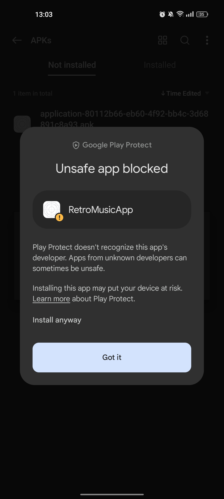

## Manual de Instalación | Fase 3 

###### _2023 - Laboratorio de Análisis y Diseño de Sistemas 2_

### Descarga
Para descargar la aplicación de RetroMusic se deberá dirigir al siguiente
enlace [RetroMusicAppLink](https://expo.dev/artifacts/eas/gPeco2DUF4ULSPgkF3jXjT.apk). 
La descarga se iniciara automáticamente, posteriormente la encontrará en el
folder de descargas o en el folder que usted haya seleccionado por defecto.

### Instalación
1. Debe presionar sobre el archivo __.apk__ descargado.

2. Presione en el botón __Install__ o __Instalar__.

3. Presione en el botón __More details__ o __Más detalles__.

4. Presione en el botón __Install anyway__ o __Instalar de todas formas__.

5. Al terminar la instalación podrá iniciarla con el botón __Open__ o 
__Abrir__ o si no desea utilizarla en ese momento presione __Done__ o
__Terminar__.

### Aplicación
Una vez instalada la aplicación podrá encontrarla junto al resto de sus
aplicaciones preferidas.

