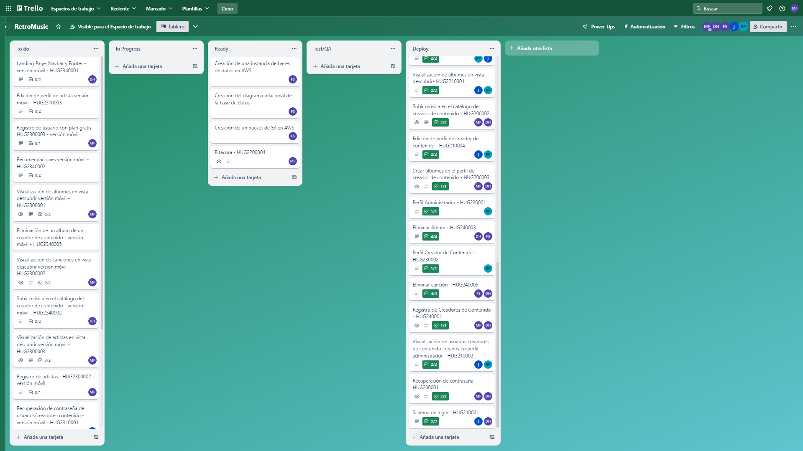
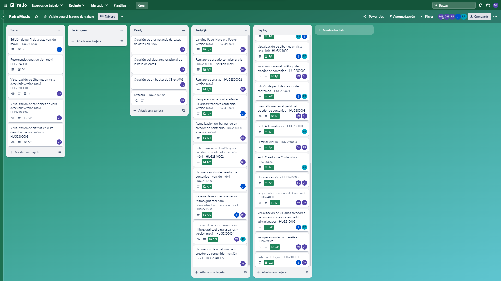

## Reporte Sprint 1 | Fase 3 

### _Grabación de Scrum Planning_
Esta reunión marcó el inicio del primer sprint de la tercera fase del proyecto, donde se discutieron y repartieron las tareas que conlleva dicha propuesta realizada en el primer sprint de la tercera fase del mismo, continuando con los roles tomados para cada integrante. Esta realizada el día 27 de Septiembre, donde a continuación se muestra su respectiva grabación:

### _Grabaciones de Daily Scrum_
Se realizaron reuniones diarias donde se discutían los avances de la fase 3 del proyecto proporcionado, donde se respondían las preguntas: ¿Qué hice hoy?, ¿Que haré mañana?, y se discutieron dificultades para posibles soluciones dentro de las mismas. Las dailys sprint se desarrollaron desde el 28 de Septiembre hasta el 10 de Octubre, sin embargo las grabaciones inician desde el día 29 de Septiembre hasta el 09 de Octubre en días hábiles, las cuales se presentan a continuación:

- 29 de Septiembre

- 02 de Octubre

- 04 de Octubre

- 06 de Octubre

- 09 de Octubre

### _Grabación de Scrum Retrospective_
Esta reunión marcó el fin del primer sprint de la tercera fase del proyecto proporcionado, donde se respondían las preguntas: ¿Qué se hizo bien durante el Sprint?, ¿Qué se hizo mal durante el Sprint? y ¿Qué mejoras se deben implementar para el próximo sprint?, esto realizado por cada integrante del grupo, esta realizada el 11 de Octubre.

### _Elementos del Sprint Backlog_

| Nombre | Encargado/s  | Terminado |
| ------ | ------------ | --------- | 
| Landing page, navbar y footer | David Maldonado | Si |
| Registro de usuario y artista | Marvin Estrada | Si |
| Login de administrador, usuario y artista | Rodrigo Porón | Si |
| Recuperación de contraseña de usuario | Javier Alfaro | Si |
| Reportes de administrador | David Maldonado y Javier Alfaro | Si |
| Reportes de usuario | Rodrigo Porón y Marvin Estrada | Si |
| Subir banner de artista | Marvin Estrada | Si |
| Subir música a la plataforma | David Maldonado | Si |
| Creación de albumes | Rodrigo Porón | Si |
| Eliminar canción | Javier Alfaro | Si |
| Eliminar album | Fernando Gómez | Si |

Asimismo se realizaron las pruebas End 2 End sobre cada funcionalidad, dando un total de 12 de las mismas, estas realizadas en el framework cypress, todas estas realizadas en el primer sprint de la tercera fase del proyecto.

### _Tablero previo al inicio del Sprint_

### _Tablero al finalizar el Sprint_

###### _2023 - Laboratorio de Análisis y Diseño de Sistemas 2_
---