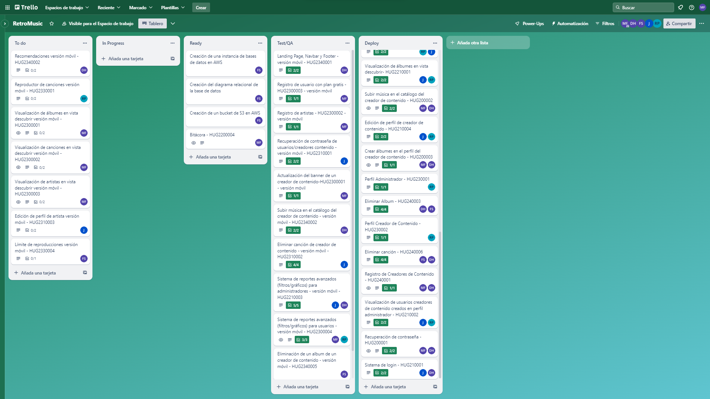
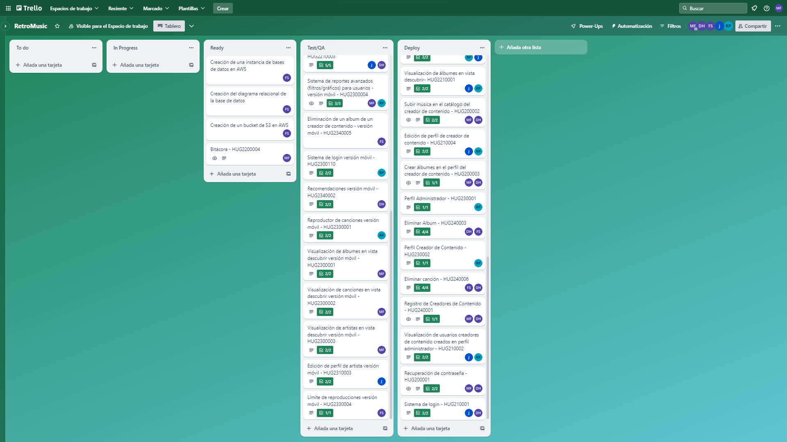

## Reporte Sprint 2 | Fase 2 

### _Grabación de Scrum Planning_
Esta reunión marcó el inicio del segundo sprint de la tercera fase del proyecto, donde se discutieron y repartieron las tareas que conlleva dicha propuesta realizada en la primera fase del proyecto, continuando con los roles tomados para cada integrante. Esta realizada el día 12 de Octubre, donde a continuación se muestra su respectiva grabación:

### _Grabaciones de Daily Scrum_
Se realizaron reuniones diarias donde se discutían los avances de la fase 3 del proyecto proporcionado, donde se respondían las preguntas: ¿Qué hice hoy?, ¿Que haré mañana?, y se discutieron dificultades para posibles soluciones dentro de las mismas. Las dailys sprint se desarrollaron desde el 13 de Octubre hasta el 20 de Octubre en días hábiles, las cuales se presentan a continuación:

- 13 de Octubre

- 16 de Octubre

- 18 de Octubre

- 19 de Octubre

- 20 de Octubre

### _Grabación de Scrum Retrospective_
Esta reunión marcó el fin del segundo sprint de la tercera fase del proyecto proporcionado, donde se respondían las preguntas: ¿Qué se hizo bien durante el Sprint?, ¿Qué se hizo mal durante el Sprint? y ¿Qué mejoras se deben implementar para el próximo sprint?, esto realizado por cada integrante del grupo, esta realizada el 23 de Octubre.

### _Elementos del Sprint Backlog_

| Nombre | Encargado/s  | Terminado |
| ------ | ------------ | --------- | 
| Recomendaciones | David Maldonado | Si |
| Reproductor de música | Rodrigo Porón | Si |
| Visualización de artistas, álbumes y canciones | Marvin Estrada | Si |
| Editar información de artista | Javier Alfaro | Si |
| Límite de reproducciones | Fernando Gómez | Si |
| Despliegue para el backend para este sprint | Marvin Estrada | Si |

### _Tablero previo al inicio del Sprint_

### _Tablero al finalizar el Sprint_

###### _2023 - Laboratorio de Análisis y Diseño de Sistemas 2_
---
