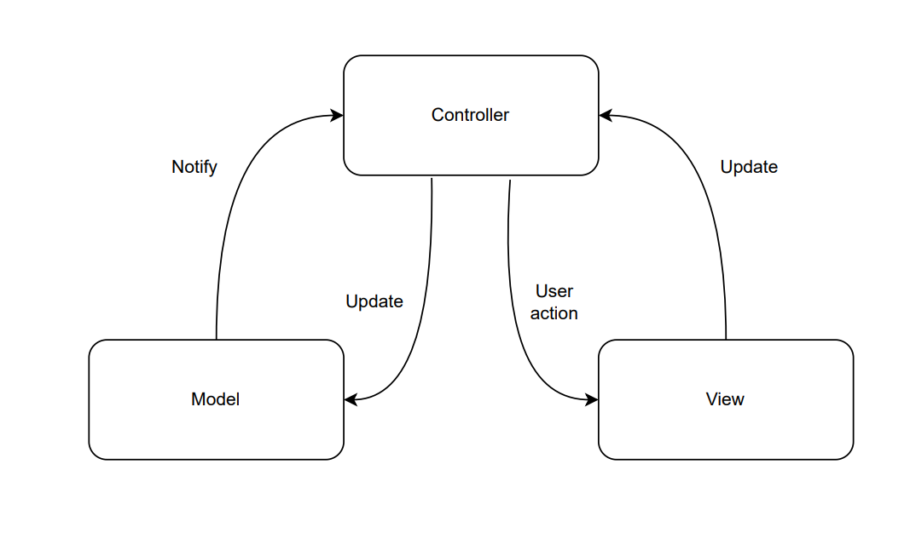

## Manual técnico | Fase 2 

### _Descripción_

Se desea crear una aplicación web y aplicación móvil que permita a creadores de contenido (artistas) poder registrarse e iniciar sesión, al momento de iniciar sesión podrán ver la música que han subido, así como sus álbumes. Se podrán eliminar o editar a como el creador de contenido desee.

Contará con un administrador que podrá ver a todos los creadores de contenido registrados en la plataforma y podrá deshabilitar sus usuarios según lo considere necesario. Tanto en la versión web como en la aplicación móvil, se podrán ver diferentes reportes, sin embargo, la aplicación móvil tendrá la opción extra de poder ver reportes con filtro de fecha.

### _Tecnologías utilizadas_

#### Aplicación Móvil

Para el desarrollo de la aplicación móvil se utilizaron las siguientes librerías y frameworks:

- React Native: Se decidió, principalmente, el desarrollo de la app móvil con React Native por su baja curva de aprendizaje, ya que se utilizó ReactJS para el desarrollo de la aplicación web, lo que permitió que el desarrollo de la aplicación móvil fuera más rápido y sencillo, como también por su gran comunidad, lo que permitió que se encontraran soluciones a los problemas que se presentaron durante el desarrollo de la aplicación móvil.

- React Navigation: Se utilizó para el enrutado de la aplicación móvil, ya que permite la creación de rutas de forma más sencilla, como también una mejor distribución de las mismas, lo que permite una mejor experiencia de usuario.

- Expo: Como empaquetar la aplicación móvil con React Native es un proceso que requiere de ciertos conocimientos, se decidió utilizar Expo como plataforma de desarrollo, ya que provee lo necesario para el desarrollo de la misma. Expo permite ejecutar la aplicación que se está desarrollando en varios entornos, como por ejemplo en un emulador, en un dispositivo físico, etc.

- Tailwind CSS: Se utilizó para el desarrollo de la interfaz de usuario, ya que permite la creación de componentes de forma más rápida y sencilla, como también una mejor distribución de los mismos, lo que permite una mejor experiencia de usuario. También, al haber trabajado con Tailwind CSS en el desarrollo de la aplicación web, se decidió utilizarlo en la aplicación móvil para mantener la consistencia en la interfaz de usuario.

#### Frontend

Para el desarrollo del frontend se utilizaron las siguientes librerías y frameworks:

- NextJS (Framework de ReactJS): Se utilizó para el desarrollo de la aplicación web, ya que permite la creación de aplicaciones web de una sola página, así como también aplicaciones web con múltiples páginas, lo que permite una mejor distribución de las vistas de la aplicación, como también una mejor distribución de los componentes que se utilizan en la misma. Además que posee del renderizado del lado del servidor, lo que permite una mejor optimización de la aplicación, como también una mejor experiencia de usuario.

- TailwindCSS (CSS): Se utilizó para el desarrollo de la interfaz de usuario, ya que permite la creación de componentes de forma más rápida y sencilla, como también una mejor distribución de los mismos, lo que permite una mejor experiencia de usuario.

- React Icons: Se utilizó para la implementación de iconos en la aplicación web.

Dado el crecimiento de la aplicación para la versión 2 de la misma, se notó un crecimiento en el retardo de renderizado de ciertas páginas.

Esto hizo necesario el uso de ciertas funcionalidades (algunas experimentales como las server actions que trae la versión 13 de NextJS), que permitieran mejorar el rendimiento de la aplicación.

Se logró haciendo uso del renderizado del lado del servidor, lo que permitió que el tiempo de carga de la aplicación disminuyera considerablemente, como también el retardo de renderizado de ciertas páginas. Solo se hizo uso del renderizado del lado del cliente donde fuera estrictamente necesario debido a la naturaleza de la aplicación.

#### Backend

Para el desarrollo del backend se utilizaron las siguientes librerías y frameworks:

- ExpressJS: Se utilizó para el desarrollo del servidor, es una herramienta que permite crear servidores con un buen rendimiento y una buena experiencia para el desarrollador.

- MySQL: Se implementó esta librería para la conexión con la base de datos.

#### Base de datos

La base de datos se encuentra alojada en Amazon Web Services, en la cual se utilizó la tecnología de Amazon RDS, la cual es una base de datos relacional, en la cual se utilizó MySQL como motor de base de datos.

### _Instalación_

#### Aplicación Móvil

Para la instalación de la aplicación móvil se debe ejecutar el siguiente comando en la carpeta del proyecto:

```bash
npm install
```

#### Frontend

Para la instalación del frontend se debe ejecutar el siguiente comando en la carpeta del proyecto:

```bash
npm install
```

#### Backend

Para la instalación del backend se debe ejecutar el siguiente comando en la carpeta del proyecto:

```bash
npm install
```

#### Base de Datos

Para poder acceder a la base de datos se debe tener instalado un cliente de MySQL y solicitar las credenciales al administrador del proyecto.

### _Ejecución_

#### Aplicación Móvil

Para la ejecución de la aplicación móvil se debe ejecutar el siguiente comando en la carpeta del proyecto:

```bash
npm run start
```

Este comando ejecutará la aplicación móvil en un entorno de desarrollo, lo que permitirá que se pueda ejecutar la aplicación móvil en un dispositivo físico o en un emulador. Expo (el empaquetador de la aplicación) mostrará un código QR que se debe escanear con la aplicación móvil de Expo para poder ejecutar la aplicación móvil.

#### Frontend

Para la ejecución del frontend se debe ejecutar el siguiente comando en la carpeta del proyecto:

```bash
npm run dev
```

#### Backend

Para la ejecución del backend se debe ejecutar el siguiente comando en la carpeta del proyecto:

```bash
node index.js
```

### _Diagrama inicial del diseño arquitectónico implementado_

- `Diagrama del patrón de arquitectura implementado:` Se realizó la implementación del patrón arquitectónico Model View Controller(MVC), donde se tiene un manejo de información más distribuida sobre los archivos creados en la parte del backend del proyecto, donde se manejaron los controladores, los cuales manejan una parte más lógica sin administrar ningún aspecto de la base de datos, esto último se encarga los modelos del servidor, ya que estos poseen las consultas a la misma para que las solicitudes que se le realicen al servidor sean más distribuidas y no concentradas, esto optimizando estar propensos a errores que detengan la funcionalidad completa del backend, pero como se detalla más adelante, la lógica de los modelos fué incluso más distribuida. Por último se tiene el área de vistas, donde el servidor del frontend funciona de una manera más amplia y correctamente distribuida con este último aspecto, proporcionando vistas que interactuan con el usuario final, como también retroalimentación al mismo.

  

- `Diagrama del diseño de arquitectura implementado:` Para el diseño de la arquitectura del proyecto actual en esta primera fase, constó de la utilización de dos servidores, estos correspondientes al área de backend y frontend, sobre los cuales se utilizaron las tecnologías React y NodeJS respectivamente, este último tiene comunicación directa con la base de datos ubicada en Amazon Web Services, donde se utilizaron las tecnologías de Amazon RDS de tipo base de datos relacional, donde también se utilizó Amazon S3 para el almacenamiento de imágenes y archivos de audio. En esta segunda fase se implementó la utilización de la nube en el apartado del frontend, como también en el backend, donde estos se incorporaron a las herramientas de Vercel y Amazon EC2 respectivamente. Todo esto interactuando de forma directa con el cliente por la parte de frontend en cualquier dispositivo final, pero enfocado en un ordenador.

  

### _Diagramas de patrones de diseño implementados_

- `Patrón de diseño Singleton:` Este patrón es parte fundamental en la ejecución del backend, ya que por la forma de implementarse únicamente se tiene una instancia a la vez a lo largo de la ejecución del servidor, lo que ayuda a garantizar que una clase tenga una única instancia en todo el ciclo de vida de una aplicación. Esto es útil cuando se necesita tener un único punto de acceso global a una instancia particular, en este caso la instancia es la ejecución del servidor en el área del backend.

  

- `Patrón de diseño Repository:` Se utilizó para separar la lógica de acceso a datos de alto nivel de la implementación concreta de cómo se almacenan y recuperan los datos. Proporciona una interfaz común para acceder a los datos, permitiendo que el código de negocio interactúe con los datos de manera independiente de la fuente subyacente, como en este caso la base de datos. Esto mejoró la mantenibilidad y flexibilidad del sistema al centralizar la lógica de acceso a datos, partiendo anteriormente del modelo MVC, y quitandole aún más responsabilidades en el aspecto de manejo de datos al área de los modelos, repartiendolas en la parte del patrón repositorio.

  

- `Patrón de composición`: Este implementado en el área de frontend, donde la arquitectura del patrón de composición es un enfoque de diseño en la programación orientada a objetos que permite crear estructuras jerárquicas complejas al combinar objetos más simples en una composición jerárquica. En este patrón, se pueden crear relaciones de "todo-parte" entre los objetos, lo que facilita la creación y manipulación de estructuras complejas de manera modular y flexible. En la arquitectura del patrón de composición, los objetos individuales y los objetos compuestos se tratan de manera uniforme a través de una interfaz común. Esto significa que se pueden aplicar las mismas operaciones a ambos tipos de objetos, lo que simplifica considerablemente el código y la interacción entre los componentes.

  

### _Diagrama Entidad-Relación de la base de datos_


### _Rutas utilizadas en el backend_

- **_Rutas de administrador:_**

  - `GET /artists`: Obtiene todos los artistas registrados en la plataforma.

  - `POST /artistsManagment`: Actualiza el estado de un artista.

  - `GET /TopSongs`: Obtiene el top 5 de canciones mas escuchadas en todo el servicio.

  - `GET /TopAlbums`: Obtiene el top 5 de albumes mas escuchados en todo el servicio.

  - `GET /TopArtists`: Obtiene el top 5 de artistas mas escuchados en todo el servicio.

  - `GET /allSongsGenres`: Obtiene la lista completa de géneros de las canciones.

  - `GET /TopSongsFiltro`: Obtiene el top 5 canciones con filtro de género.

  - `GET /TopAlbumsFiltro`: Obtiene el top 5 albumes con filtrado de reproducciones.

  - `GET /TopArtistsFiltro`: Obtiene el top 5 artistas con filtrado de reproducciones.

  - `GET /allSongsDates`: Obtiene el top canciones globales con filtrado por fechas.

  - `GET /TopSongsAlltime`: Obtiene el top canciones globales con filtrado por fechas en la tabla reportes.

- **_Rutas de artista:_**

  - `GET /banner/:userId`: Obtiene el banner de un artista.

  - `GET /songs/:userId`: Obtiene las canciones de un artista.

  - `GET /availableSongs/:userId`: Obtiene las canciones disponibles de un artista.

  - `GET /albums/:userId`: Obtiene los álbumes de un artista.

  - `POST /banner`: Actualiza el banner de un artista.

  - `POST /Profile`: Actualiza el perfil de un artista.

  - `POST /ProfileConfig`: Actualiza la configuración del perfil de un artista.

  - `POST /uploadSong`: Sube una canción a la plataforma.

  - `POST /createAlbum`: Crea un álbum.

  - `DELETE /deleteSong/:id`: Elimina una canción.

  - `DELETE /deleteAlbum/:id`: Elimina un álbum.

- **_Rutas para login:_**

  - `POST /`: Iniciar sesión con los datos del usuario que se envían en el body de la petición.

  - `POST /passwordChange`: Cambiar la contraseña del usuario.

  - `POST /passwordChange/update`: Actualizar la contraseña del usuario.

- **_Rutas para usuario:_**

  - `GET /songs/:userId`: Obtener la lista de todos las canciones en el servicio en la vista descubrir.

  - `GET /albums/:userId`: Devuelve todas los albumes pertenecientes al servicio.

  - `GET /albums/songs/:idAlbum`: Devuelve todas las canciones pertenecientes a un album.

  - `GET /artists`: Devuelve todos los artistas pertenecientes al servicio.

  - `GET /artists/songs/:userId`: Devuelve todas las canciones pertenecientes a un artista.

  - `GET /artists/albums/:userId`: Devuelve todas los albumes pertenecientes a un artista.

  - `POST /Profile`: Devuelve toda la informacion perteneciente a un usuario consumidor del servicio de RetroMusic.

  - `POST /ProfileConfig`: Encargado de cambiar la informacion de cuenta del usuario que solicita dicha accion.

  - `POST /MusicCounter`: Actualiza el contador global de reproduccion de la cancion escuchada por los usuarios del servicio.

  - `POST /recomendations`: Encargado de brindar una sugerencia de canciones las cuales estan causando tendencia en la aplicacion.

  - `POST /userLimit`: Actualiza el contador diario de reproduccion por parte de un usuario sin subscripcion premium.

  - `GET /historial/:idUsuario`: Obtiene el listado de canciones escuchadas por el usuario con filtrado por fecha.

  - `GET /listenedTime/:idUsuario`: Obtiene la cantidad de tiempo escuchado por el usuario con filtrado por fecha.

  - `GET /listenedSongs/:idUsuario`: Obtiene la cantidad de canciones escuchadas con filtrado por fecha.

- **_Rutas para registro de usuario:_**

  - `POST /free`: Almacena al usuario en cuestion en el servicio de RetroMusic.

- **_Rutas para registro de artista:_**

  - `POST /`: Almacena al artista en cuestion en el servicio de RetroMusic.

### _Estructura de carpetas del frontend_


- **_Public_**: En esta carpeta se encuentran los archivos que se utilizan en la aplicación web, como por ejemplo las imágenes estáticas.

- **_components_**: En esta carpeta se encuentran los componentes que se utilizan en la aplicación web, como por ejemplo el componente de la barra de navegación, el componente Album, etc.

- **_app_**: Esta carpeta se utiliza para la configuración del enrutado de NextJS guardando las páginas que se muestran en la aplicación web, como por ejemplo la página de inicio, la página de inicio de sesión, etc.

- **_constants_**: En esta carpeta se encuentran las constantes que se utilizan en la aplicación web, como por ejemplo las rutas de la API.

- **_types_**: En esta carpeta se encuentran los tipos de datos que se utilizan en la aplicación web, como por ejemplo el tipo de dato de un artista.

### _Mockups de la aplicación_

Los mockups son una representación estática de la interfaz de usuario, en este caso se utilizaron para representar la interfaz de usuario de la aplicación web.

En el siguiente enlace se puede acceder a los mockups de la aplicación web: [Mockups](https://www.figma.com/file/mUZaW69b3FZdV4Sk1pS2cA/AYD2?type=design&node-id=1%3A13&mode=design&t=Bt24zq7g7kY28EG5-1)

###### _2023 - Laboratorio de Análisis y Diseño de Sistemas 2_

---
