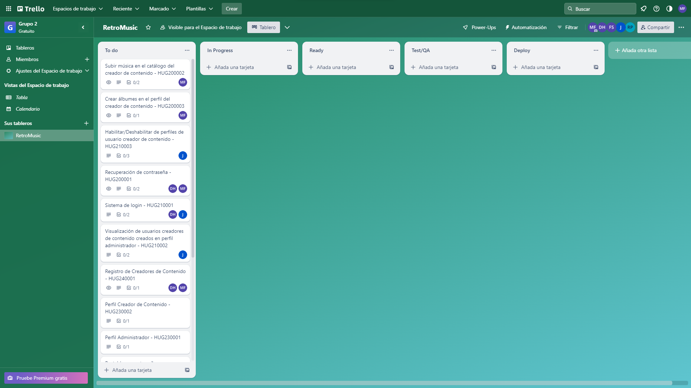
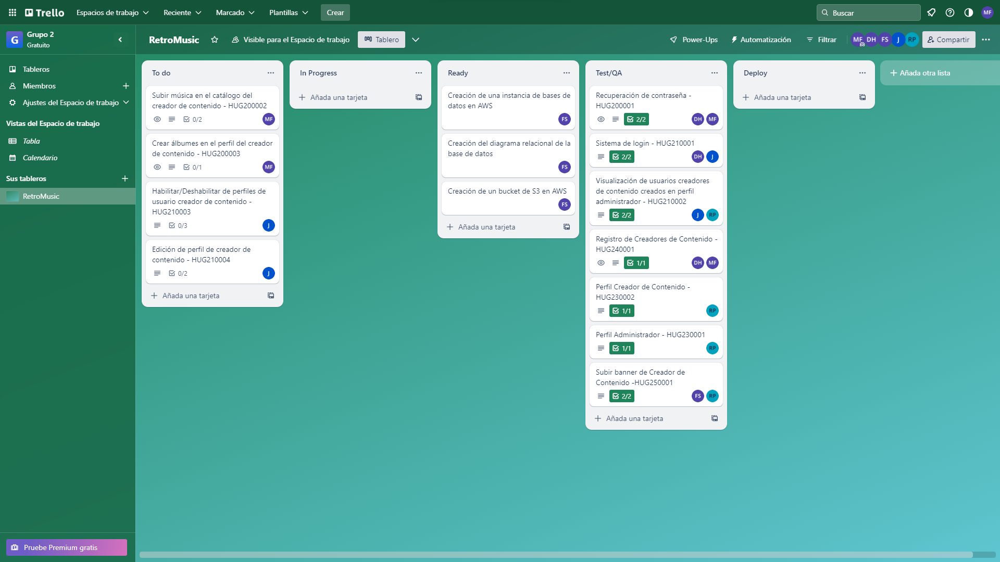

## Reporte Sprint 1 | Fase 1 

### _Grabación de Scrum Planning_
Esta reunión marcó el inicio del primer sprint de la primera fase del proyecto, donde se discutió la propuesta de negocio a realizar, las posibles tareas que conlleva dicha propuesta, como también los distintos roles que tomaría cada integrante. Esta realizada el día 30 de Julio, donde a continuación se muestra su respectiva grabación:

### _Grabaciones de Daily Scrum_
Se realizaron reuniones diarias donde se discutían los avances de la fase 1 del proyecto proporcionado, donde se respondían las preguntas: ¿Qué hice hoy?, ¿Que haré mañana?, y se discutieron dificultades para posibles soluciones dentro de las mismas. Las grabaciones inician desde el día 31 de Julio hasta el 11 de Agosto en días hábiles, las cuales se presentan a continuación:

### _Grabaciones de Scrum Retrospective_
Esta reunión marcó el fin del primer sprint de la primera fase del proyecto proporcionado, donde se respondían las preguntas: ¿Qué se hizo bien durante el Sprint?, ¿Qué se hizo mal durante el Sprint? y ¿Qué mejoras se deben implementar para el próximo sprint?, esto realizado por cada integrante del grupo.

### _Elementos del Sprint Backlog_

| Nombre | Encargado/s  | Terminado |
| ----- | ----- | ----- | 
| Sistema de login | David Maldonado y Javier Alfaro | Si | 
| Registro de creadores de contenido | David Maldonado y Marvin Estrada | Si |
| Perfil administrador | Rodrigo Porón | Si |
| Perfil creador de contenido | Rodrigo Porón | Si |
| Recuperación de contraseña | David Maldonado y Marvin Estrada | Si |
| Visualización de usuarios creadores de contenido en perfil administrador | Rodrigo Porón y Javier Alfaro | Si |
| Subir banner de creador de contenido | Rodrigo Porón y Fernando Gómez | Si |
| Creación de una instancia de bases de datos en AWS | Fernando Gómez | Si |
| Creación del diagrama realacional de la base de datos | Fernando Gómez | Si |
| Creación de un bucket de S3 en AWS | Fernando Gómez | Si |

### _Tablero previo al inicio del Sprint_

### _Tablero al finalizar el Sprint_

###### _2023 - Laboratorio de Análisis y Diseño de Sistemas 2_
---
