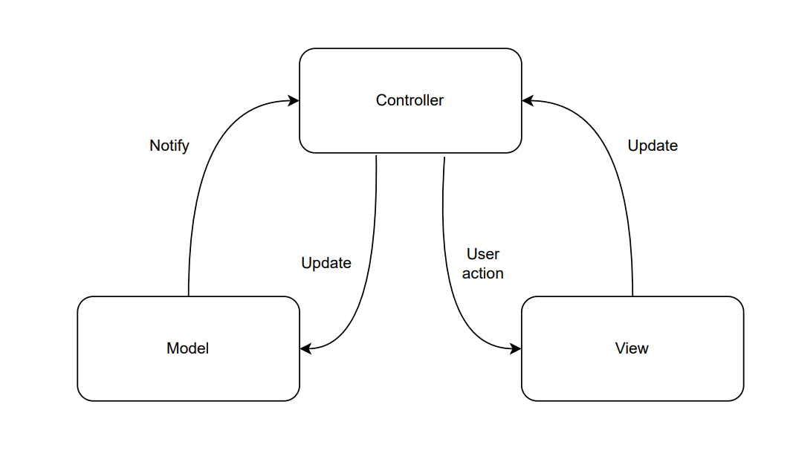
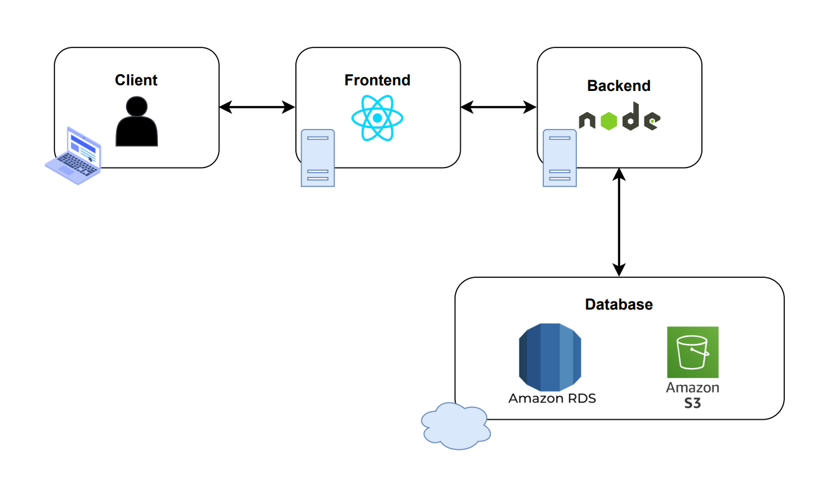
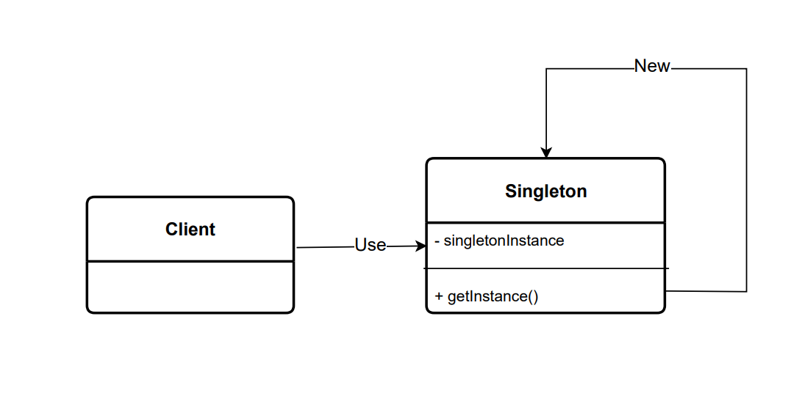
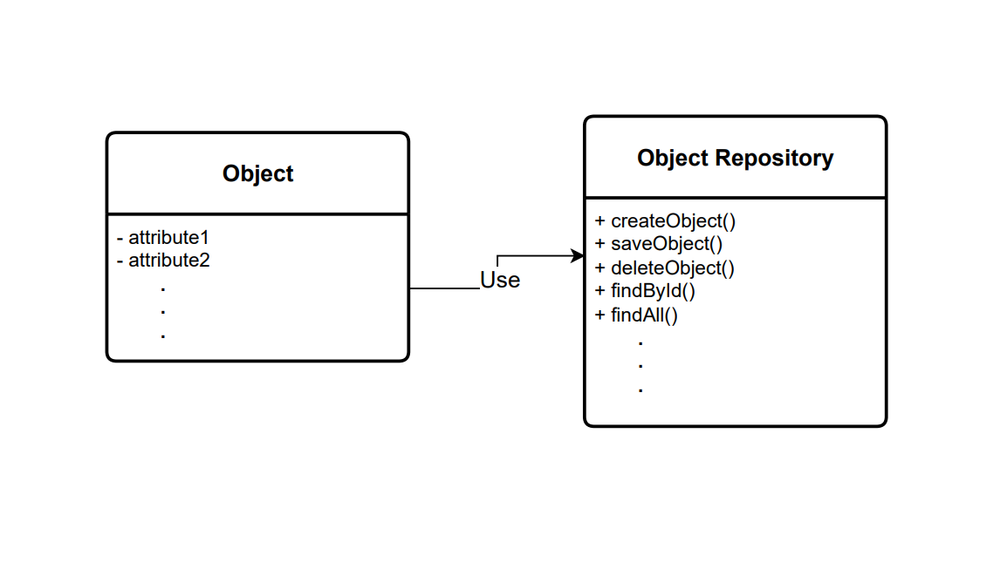

## Manual técnico | Fase 1 

### _Titulo ejemplo_
Contenido de ejemplo

### _Diagrama inicial del diseño arquitectónico implementado_
- `Diagrama del patrón de arquitectura implementado:` Se realizó la implementación del patrón arquitectónico Model View Controller(MVC), donde se tiene un manejo de información más distribuida sobre los archivos creados en la parte del backend del proyecto, donde se manejaron los controladores, los cuales manejan una parte más lógica sin administrar ningún aspecto de la base de datos, esto último se encarga los modelos del servidor, ya que estos poseen las consultas a la misma para que las solicitudes que se le realicen al servidor sean más distribuidas y no concentradas, esto optimizando estar propensos a errores que detengan la funcionalidad completa del backend, pero como se detalla más adelante, la lógica de los modelos fué incluso más distribuida. Por último se tiene el área de vistas, donde el servidor del frontend funciona de una manera más amplia y correctamente distribuida con este último aspecto, proporcionando vistas que interactuan con el usuario final, como también retroalimentación al mismo. 

    

- `Diagrama del diseño de arquitectura implementado:` Para el diseño de la arquitectura del proyecto actual en esta primera fase, constó de la utilización de dos servidores, estos correspondientes al área de backend y frontend, sobre los cuales se utilizaron las tecnologías React y NodeJS respectivamente, este último tiene comunicación directa con la base de datos ubicada en Amazon Web Services, donde se utílizaron las tecnologías de Amazon RDS de tipo base de datos relacional, donde también se utilizó Amazon S3 para el almacenamiento de imagenes y archivos de audio. Todo esto interactuando de forma directa con el cliente por la parte de frontend en cualquier dispositivo final, pero enfocado en un ordenador.

    

### _Diagramas de patrones de diseño implementados_

- `Patrón de diseño Singleton:` Este patrón es parte fundamental en la ejecución del backend, ya que por la forma de implementarse únicamente se tiene una instancia a la vez a lo largo de la ejecución del servidor, lo que ayuda a garantizar que una clase tenga una única instancia en todo el ciclo de vida de una aplicación. Esto es útil cuando se necesita tener un único punto de acceso global a una instancia particular, en este caso la instancia es la ejecución del servidor en el área del backend.

    

- `Patrón de diseño Repository:` Se utilizó para separar la lógica de acceso a datos de alto nivel de la implementación concreta de cómo se almacenan y recuperan los datos. Proporciona una interfaz común para acceder a los datos, permitiendo que el código de negocio interactúe con los datos de manera independiente de la fuente subyacente, como en este caso la base de datos. Esto mejoró la mantenibilidad y flexibilidad del sistema al centralizar la lógica de acceso a datos, partiendo anteriormente del modelo MVC, y quitandole aún más responsabilidades en el aspecto de manejo de datos al área de los modelos, repartiendolas en la parte del patrón repositorio.

    

###### _2023 - Laboratorio de Análisis y Diseño de Sistemas 2_
---
