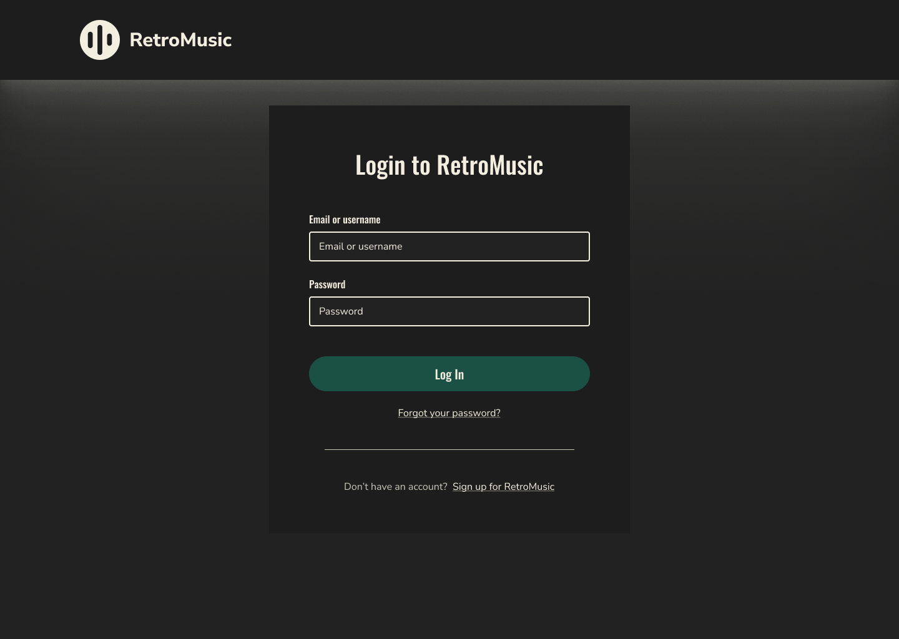
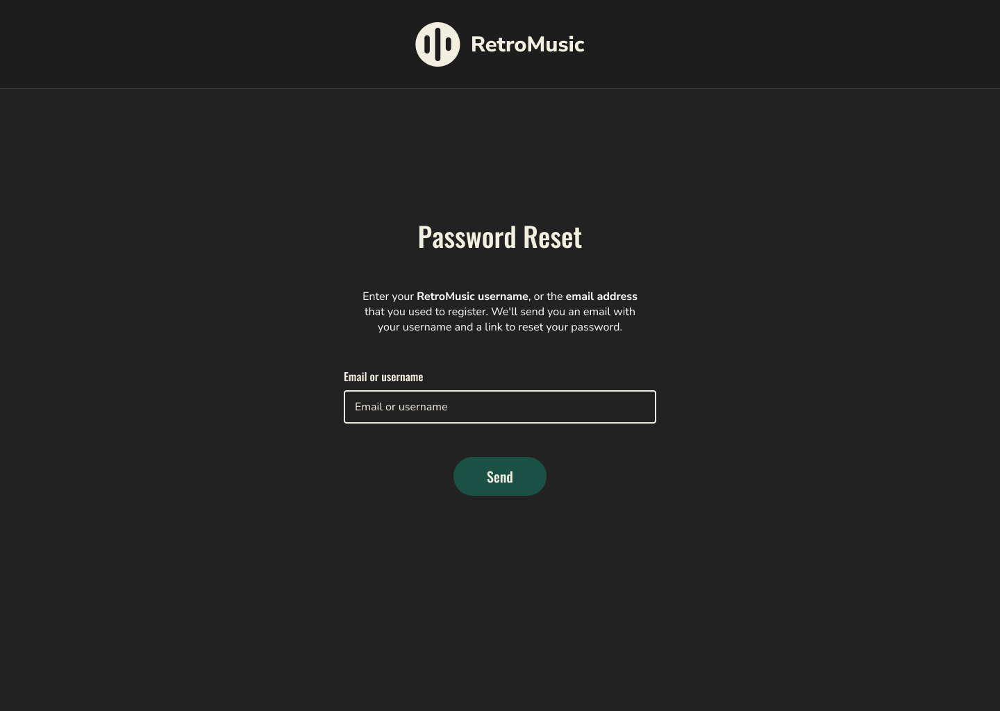
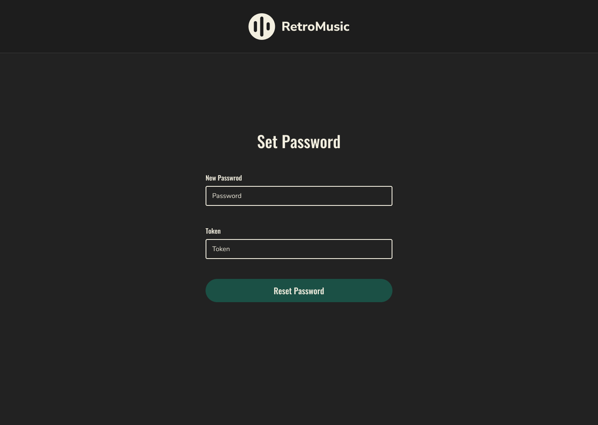

## Manual de usuario | Fase 1 

###### _2023 - Laboratorio de Análisis y Diseño de Sistemas 2_
---

### _Landing Page_

La Landing Page de Retro Music esta conformada por la barra de navegación que posee las opciones de dirigirse al registro, inicio de sesión o regresar al
inicio de la página. Además contiene un área principal que le da una
bienvenida y una pequeña descripción de lo que trata la página web. Por último
se encuentra el pie de página que contiene el logo junto a información de la
página.

### _Registro_

La página de registro posee un formulario con la información requerida para
se pueda crear una cuenta y poder compartir contenido en la plataforma, una
vez llenados los datos se deberá presionar el botón de _"Sing Up"_ 
posteriormente se podrá iniciar sesión. Para iniciar sesión se puede presionar
el link _"Log in"_ o redirigirse a la Landing Page presionando el logo de 
_"Retro Music"_ y de está ubicación se escoge la opción de la barra de
navegación para el inicio de sesión que es _"Log In"_.

### _Login_

En está página se podrá iniciar sesión a la plataforma ingresando el nombre de
usuario y la contraseña y presionando el botón _"Log In"_ y en caso de que las
credenciales sean incorrectas se mostrará un mensaje de error. 

Si por algún motivo se ha olvidado de la contraseña deberá presionar el 
enlace _"Forgot your password?"_ que lo dirigirá a la una página en la cuál podrá solicitar un cambio de contraseña. 

Si no tiene una cuenta a través del link _"Sing up for RetroMusic"_ lo 
llevará al formulario de registro donde podrá crear una cuenta.

Si presiona el logo de la plataforma será redireccionado hacía la LandingPage.

### _Recuperación de Contraseña_

#### Solicitud de Cambio de Contraseña

A través de está página podrá realizar una solicitud de cambio de contraseña
ingresando su correo y posteriormente presionando el botón _"Send"_ una vez
realizado estos pasos se le enviará a su correo un token con el que posteriormente
podrá cambiar su contraseña en la página a la que ha sido redirigido.

#### Formulario de Cambio de Contraseña

En esta página podrá ingresar su nueva contraseña y el token que ha sido
enviado a su correo para poder realizar el cambio de contraseña.

### _Administrador_

Como administrador podrá ver un listado de todos los artistas que se han 
registrado en la plataforma y tendrá la opción de habilitar o deshabilitar
las cuentas de los mismos.

Podrá cerrar sesión presionando el botón _"Log Out"_.

### _Artista_

#### Pagina Principal

Si es artista después de haber realizado el inicio de sesión podrá ver las
primeras 3 canciones que ha subido a la plataforma y en caso de que no tenga
canciones compartidas se mostrará un enlace que le redirigirá hacía el
formulario para poder subir una canción. Además tendrá la opción de eliminar
la canción que desee presionando el botón _"Delete"_.

Si presiona el enlace _"See All"_ podrá ver todas las canciones que ha
compartido en nuestra plataforma.

#### Perfil

En está página podrá visualizar el banner que ha escogido además de 
su nombre.

#### Subir Canción

Deberá escoger el archivo de audio para la nueva canción, ingresar el nombre
de la misma así como el genero, una vez llenados estos campos podrá subirla
a la plataforma presionando el botón _"Upload."_

#### Canciones

En está vista podrá observar todas las canciones que ha compartido en nuestra
plataforma y tendrá la opción de eliminar la canción que desee presionando el botón _"Delete"_.

#### Crear Álbum

En está sección podrá crear un álbum. Para realizar está acción se necesita
que escoja la caratula, el nombre y las canciones que pertenecerán al
álbum.

#### Álbumes

En está página podrá ver todos los álbumes que ha creado en la plataforma,
las canciones que lo conforman además tendrá la opción de eliminar
el álbum que desee presionando el botón _"Delete"_.

#### Banner

En esta página deberá escoger la imagen que quiera utilizar como banner de su
perfil. Para confirmar la imagen deberá presionar el botón _"Subir"_.

#### Editar Perfil

Si desea actualizar los datos de su perfil deberá llenar el formulario que
se le presenta en esta página y presionar el botón _"Update your profile"_.